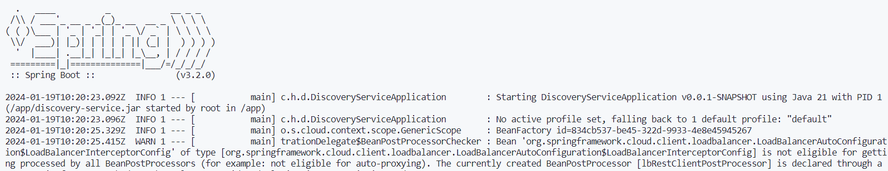
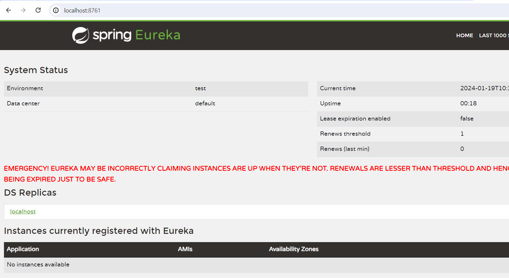
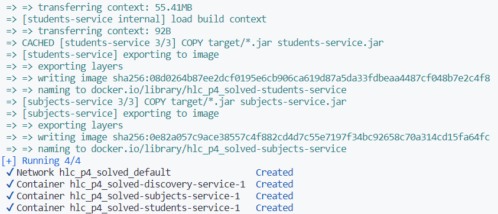
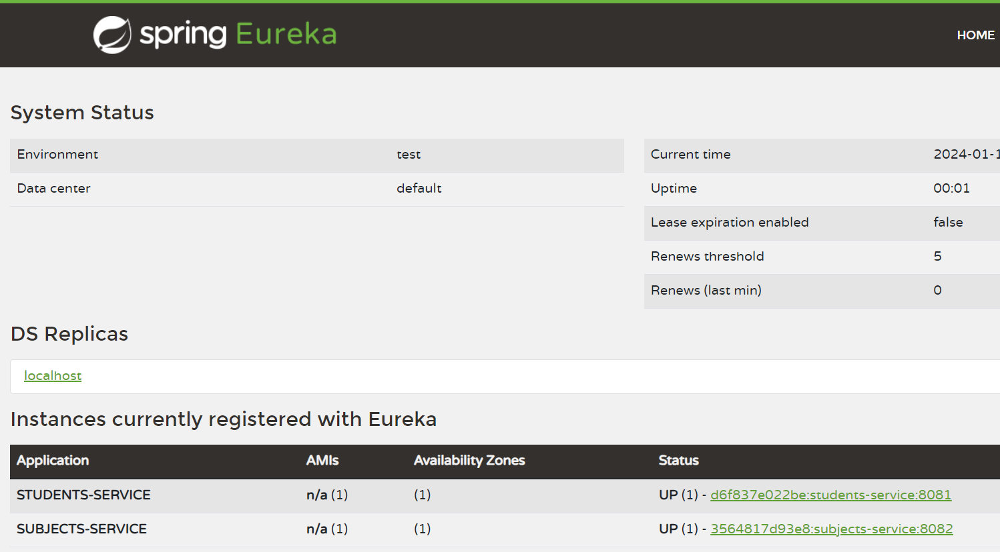

## Práctica 4: Docker y Docker-Compose

En esta práctica vamos a aprender cómo usar Docker y Docker-Compose. Para eso vamos a dockerizar los microservicios de la práctica anterior en dos fases:
1. Dockerización de los microservicios de forma independiente: crearemos un Dockerfile y un contenedor por cada microservicio, de forma que puedan funcionar de forma independiente. Sin embargo, en este paso todavía no se podrán comunicar entre sí al no estar dentro de la misma red.
2. Dockerización de los microservicios de forma conjunta: crearemos un Docker-Compose donde se orqueste la creación de los contenedores de cada microservicio, permitiendo la comunicación entre ellos.

📌 Para la realización de esta práctica, utiliza ramas en este repositorio. Puedes usar tantas ramas como creas conveniente. Realiza tantos commits como veas necesario. También puedes utilizar PR o cualquier elemento de Git/GitHub. Además, partiremos del código que hicimos en la **práctica 3**.

### Instalación de Docker

1. El primer paso es descargar **Docker** desde este enlace: https://www.docker.com/products/docker-desktop/
2. Una vez Docker se haya descargado, lo instalamos en el equipo.
3. Cuando termina la instalación, iniciamos Docker.

### Creación de la imagen de discovery-service

1. En primer lugar creamos un fichero llamado `Dockerfile` (en la raíz del proyecto correspondiente) que usará una imagen de Java 21 y expondrá el puerto 8761 para que sea accesible desde localhost:

```
FROM openjdk:21-slim

# Establece el directorio de trabajo en /app
WORKDIR /app

# Copia el archivo JAR construido en el directorio target a la imagen
COPY target/*.jar discovery-service.jar

# Expone el puerto 8761 (puerto predeterminado de Eureka)
EXPOSE 8761

# Comando para ejecutar la aplicación cuando se inicie el contenedor
CMD ["java", "-jar", "discovery-service.jar"]
```

🔎 Si te fijas en el contenido del Dockerfile, verás que en el tercer paso se copia el archivo JAR de discovery-service para después ejecutarlo al final. Por tanto, recuerda que para que este Dockerfile funcione necesitarás tener el **JAR previamente generado**. 

2. Cuando el Dockerfile está listo, creamos la imagen de Docker ejecutando el comando `docker build . -t discovery-service`. El comando **build** busca el fichero Dockerfile en el directorio especificado (en este caso usamos `.` para indicar que se encuentra en el mismo directorio desde el que ejecutamos el comando; si este directorio cambia tendremos que modificar el comando para apuntar a él). El flag `-t` se usa para asignar un nombre y un tag a la imagen. En nuestro ejemplo solo asignamos un nombre, pero si usáramos `-t discovery-service:v1` estaríamos indicando que nuestra imagen se llama **discovery-service** y está etiquetada con **v1** (si no se indica un tag, se le asigna **latest** por defecto). Aunque el uso de este flag es opcional, es conveniente usarlo para localizar más fácilmente a las imágenes que creamos, ya que en caso contrario Docker asignaría un ID autogenerado.

3. Cuando termina la ejecución del comando, comprobaremos que la imagen se ha creado sin problemas mediante el comando `docker images`, que muestra el listado de las imágenes existentes:

```
PS \HLC_P4\discovery-service> docker images
REPOSITORY            TAG       IMAGE ID       CREATED       SIZE
discovery-service    latest    14c513dd075e   2 hours ago   493MB
```

4. Ahora vamos a pasar a construir el contenedor de la imagen que hemos creado y ejecutarlo. Para eso usamos el comando `docker run -d -p 8761:8761 discovery-service`. Mediante el flag `-d` le indicamos que el contenedor se ejecute en segundo plano, y con el flag `-p 8761:8761` indicamos que se va a mapear el puerto 8761 de nuestro sistema con el puerto 8761 del contenedor (expuesto previamente en el Dockerfile).
Tras ejecutar el comando, vamos a listar los contenedores para ver si se ha creado nuestro contenedor, usando el comando `docker container ls`:
```
PS \HLC_P4\discovery-service> docker container ls
CONTAINER ID   IMAGE       COMMAND                  CREATED         STATUS         PORTS                    NAMES
36f5b99df3f3   discovery   "java -jar discovery…"   3 minutes ago   Up 3 minutes   0.0.0.0:8761->8761/tcp   kind_williamson
```

Observamos que el id del contendor en este caso es _36f5b99df3f3_. Con este id podemos ver los logs del contenedor usando el comando `docker logs 36f5b99df3f3 --tail 100` (el flag `--tail 100` es para indicar que solo muestre las últimas 100 líneas). Deberíamos ver lo siguiente:



5. Por último, comprobamos que el servicio se inicia correctamente entrando a `localhost:8761`:



### Creación del contenedor de students-service y subjects-service

1. Como paso previo, modifica el application.properties de los dos microservicios para añadir esta línea al final:

```
eureka.client.service-url.defaultZone=${EUREKA_SERVICE_URL:http://localhost:8761/}
```

Esta línea sirve para indicar dónde se encuentra Eureka. Si existe la variable de entorno EUREKA_SERVICE_URL, lo buscará en su valor, en caso contrario, en http://localhost:8761/. Este paso es necesario para que el registro de servicios en Eureka funcione dentro del Compose (lo veremos más adelante).

2. Sigue los pasos anteriores para crear el Dockerfile, la imagen y el contenedor de students-service y subjects-service. Verifica que se inician correctamente en el puerto correspondiente, pero recuerda que en los logs habrá errores porque no serán capaces de encontrar a Eureka.

💡 Cuando termines de iniciar los contenedores, investiga como **pararlos y eliminarlos** y hazlo para cada uno de ellos.

### Creación de Docker-Compose

1. Creamos el fichero docker-compose.yml en la raíz del proyecto (la carpeta contenedora de todos los servicios) con el siguiente contenido:

```yml
version: '3'

services:
  discovery-service:
    build:
      # Indicamos dónde se encuentra el Dockerfile de discovery-service
      context: ./discovery-service
    # Realizamos el mapeo de puertos de forma similar al comando run -p
    ports:
      - "8761:8761"

  students-service:
    build:
      # Indicamos dónde se encuentra el Dockerfile de students-service
      context: ./students-service
    ports:
      - "8081:8081"
    # Indicamos que este microservicio depende de discovery-service, por lo cuál se iniciará cuando el discovery ya esté iniciado
    depends_on:
      - discovery-service
    # Añadimos la variable de entorno EUREKA_SERVICE_URL
    environment:
      - EUREKA_SERVICE_URL=http://discovery-service:8761/eureka/

  subjects-service:
    build:
      context: ./subjects-service
    ports:
      - "8082:8082"
    depends_on:
      - discovery-service
    environment:
      - EUREKA_SERVICE_URL=http://discovery-service:8761/eureka/
```

Si te fijas, EUREKA_SERVICE_URL no apunta a localhost, sino a discovery-service. Esto es porque dentro de la red que crea Docker, cada microservicio es accesible desde su propio nombre. Debido a esto tuvimos que hacer el cambio anterior en application.properties.

2. Para construir y ejecutar los servicios del compose ejecutamos `docker-compose up -d`. Veremos en los logs cómo se van creando hasta que finalizan:



Si ejecutamos `docker-compose ps` se mostrarán los servicios y su estado:

```
PS \HLC_P4> docker-compose ps
NAME                                IMAGE                             COMMAND                  SERVICE             CREATED         STATUS          PORTS
hlc_p4-discovery-service-1   hlc_p4-discovery-service   "java -jar discovery…"   discovery-service   2 minutes ago   Up 40 seconds   0.0.0 0:8761->8761/tcp
hlc_p4-students-service-1    hlc_p4-students-service    "java -jar students-…"   students-service    2 minutes ago   Up 34 seconds   0.0.0.0:8081->8081/tcp
hlc_p4-subjects-service-1    hlc_p4-subjects-service    "java -jar subjects-…"   subjects-service    2 minutes ago   Up 34 seconds   0.0.0.0:8082->8082/tcp
```

3. Ahora entramos otra vez en http://localhost:8761/ y comprobamos que Eureka está iniciado con los microservicios registrados:



💡 Busca el comando para **parar** el Compose y ejecútalo cuando hayas comprobado que todo funciona.